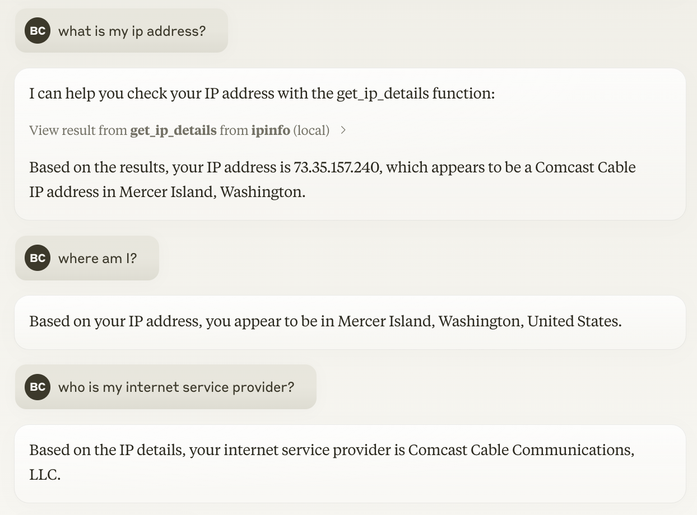

# IP Geolocation MCP Server

This is a simple [Model Context Protocol](https://modelcontextprotocol.io) server that uses the [ipinfo.io](https://ipinfo.io) API to get detailed information about an IP address.
This can be used to determine where the user is located (approximately) and what network they are used.

## Installation

You'll need to create a token to use the IPInfo API.
If you don't already have one, you can sign up for a free account at https://ipinfo.io/signup.

While each client has its own way of specifying, you'll generally use the following values:

| Field | Value |
|-------|-------|
| **Command** | `uvx` |
| **Arguments** | `mcp-server-ipinfo` |
| **Environment** | `IPINFO_API_TOKEN` = `<YOUR TOKEN>` |

### Development Version

If you'd like to use the latest and greatest, the server can be pulled straight from GitHub.
Just add an additional `--from` argument:

| Field | Value |
|-------|-------|
| **Command** | `uvx` |
| **Arguments** | `--from`, `git+https://github.com/briandconnelly/mcp-server-ipinfo`, `mcp-server-ipinfo` |
| **Environment** | `IPINFO_API_TOKEN` = `<YOUR TOKEN>` |

## Components

### Tools

- `get_ip_details`: Get detailed information about one or more IP addresses including location, ISP, and network details.
    - **Input:** `ips` (optional): List of IP addresses to analyze (IPv4 or IPv6). If not provided, analyzes the requesting client's IP address.
    - **Output:** List of `IPDetails` containing location, organization, timezone, and more.
    - **Note:** Batch lookups (multiple IPs) require `IPINFO_API_TOKEN`.

- `get_residential_proxy_info`: Check if an IP address is associated with a residential proxy service.
    - **Input:** `ip`: The IP address to check for residential proxy usage.
    - **Output:** `ResidentialProxyDetails` with proxy service name, last seen date, and activity percentage.
    - **Note:** Requires `IPINFO_API_TOKEN` with residential proxy data access.

- `get_map_url`: Generate a URL to an interactive map visualization of IP addresses.
    - **Input:** `ips`: List of IP addresses to visualize (max 500,000).
    - **Output:** URL to an interactive map on ipinfo.io showing geographic locations.
    - **Note:** Useful for visualizing geographic distribution of traffic or users.

### Resources

_No custom resources are included_

### Prompts

_No custom prompts are included_

## Configuration

### Environment Variables

| Variable | Description | Default |
|----------|-------------|---------|
| `IPINFO_API_TOKEN` | IPInfo API token for premium features | None (basic lookups only) |
| `IPINFO_CACHE_TTL` | Cache TTL in seconds | 3600 (1 hour) |

## License

MIT License - See [LICENSE](LICENSE) file for details.

## Disclaimer

This project is not affiliated with [IPInfo](https://ipinfo.io).
